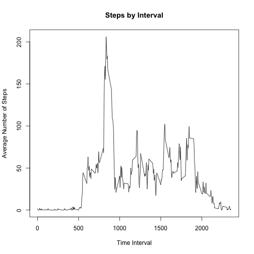

Reproducible Research: Week 2 Assignment
========================

## Loading and preproccessing the data

```r
library(lubridate)
library(plyr)
library(ggplot2)
setwd("/Users/emkarson/Documents/coursera/reproducible_research")
raw<-read.csv("activity.csv")

daily<-aggregate(steps~date,data=raw,sum)
hist(daily$steps, main="Number of Steps per Day",xlab="")
```


## What is the mean total number of steps taken per day?

```r
mean(daily$steps,na.rm=TRUE)
```

```
## [1] 10766.19
```

```r
median(daily$steps, na.rm=TRUE)
```

```
## [1] 10765
```

##What is the average daily activity pattern?

```r
interval.data<-aggregate(steps~interval,data=raw,mean)
plot(interval.data$interval,interval.data$steps,type="l",main="Steps by Interval",
     ylab="Average Number of Steps",xlab="Time Interval")
```



```r
interval.data<-interval.data[order(-interval.data$steps),]
interval.data$interval[1]
```

```
## [1] 835
```

##Imputing missing values

```r
sum(is.na(raw$steps))
```

```
## [1] 2304
```

```r
imputed<-merge(raw,interval.data,by="interval")
imputed$steps.x[is.na(imputed$steps.x)]<-imputed$steps.y[is.na(imputed$steps.x)]

imputed.daily<-aggregate(steps.x~date,data=imputed,sum)

hist(imputed.daily$steps.x, main="Number of Steps per Day (NA's imputed)",xlab="")
```


```r
mean(imputed.daily$steps.x)
```

```
## [1] 10766.19
```

```r
median(imputed.daily$steps.x)
```

```
## [1] 10766.19
```

## Are there differences in activity patterns between weekdays and weekends?

```r
imputed$weekday<-weekdays(as.Date(imputed$date,"%Y-%m-%d"))
imputed$isweekend<-imputed$weekday %in% c("Saturday","Sunday")
imputed$isweekend<-factor(imputed$isweekend)

imputed$isweekend<-revalue(imputed$isweekend, c("TRUE"="weekend", "FALSE"="weekday"))

imputed.intervals<-aggregate(steps.x~isweekend+interval, data=imputed,mean)

ggplot(data=imputed.intervals,aes(x=interval,y=steps.x))+ geom_line()+ labs(x = "Interval", y = "Number of Steps") + facet_grid(isweekend~.)+ ggtitle("Average Steps by Interval: Weekday vs. Weekend")+ theme(plot.title = element_text(hjust=0.5))
```


